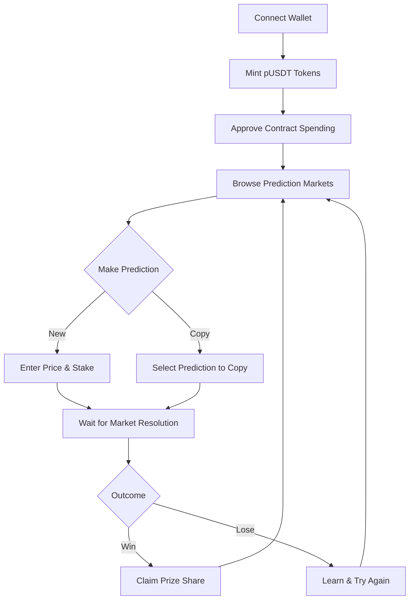

# 🎯 PredicX - Advanced Prediction Markets

> **PredicX** is a decentralized prediction market platform that combines cryptocurrency price forecasting with gamified DeFi mechanics on the **Binance Smart Chain**. Users predict crypto price movements using custom pUSDT tokens, compete for prize pools, and can copy successful predictions from top traders — all while experiencing transparent, on-chain resolution.

## 🚨 Problem

Traditional prediction markets and crypto trading face several challenges:

* ❌ **High Barrier to Entry** - Complex trading interfaces and high capital requirements
* 💸 **Lack of Social Trading** - Limited ability to learn from or copy successful traders
* 🔮 **Opaque Price Predictions** - No transparent, on-chain record of prediction accuracy
* 🎯 **Limited Engagement** - Passive holding vs. active participation in market movements

## 💡 Solution

PredicX solves these challenges through:

* ✅ **Custom pUSDT Token Economy** - Mint 1M pUSDT once per wallet to start predicting
* 🔥 **Gamified Prediction Markets** - Compete in time-limited prediction rounds with prize pools
* 👥 **Copy Trading Feature** - Replicate successful predictions from other users
* 📊 **Transparent On-Chain Resolution** - All predictions and outcomes recorded on BSC
* 🏆 **Win-Share Mechanism** - Predictions within 2% of actual price share the prize pool

## 🎮 Platform Overview

Users connect their wallet, mint pUSDT tokens, and participate in prediction markets for major cryptocurrencies:

| Feature | Description | Benefit |
|---------|-------------|---------|
| **pUSDT Minting** | One-time mint of 1,000,000 pUSDT per wallet | Zero-cost entry to prediction markets |
| **Price Prediction** | Predict future prices of BTC, ETH, BNB, SOL | Test market knowledge without real financial risk |
| **Copy Trading** | Replicate predictions from successful users | Learn from experienced predictors |
| **Prize Pools** | Win shares of pooled pUSDT for accurate predictions | Competitive rewards for skill |
| **Admin Controls** | Create markets, resolve predictions, manage contracts | Platform governance and maintenance |

## 🧩 Core Features

* **Custom pUSDT Token** - ERC-20 token for prediction staking and rewards
* **Prediction Markets** - Time-bound markets for major cryptocurrencies
* **Copy Prediction System** - Social trading functionality
* **Real-time Price Feeds** - Integration with CoinGecko API
* **Admin Dashboard** - Market creation and resolution controls
* **Wallet Integration** - MetaMask and Binance Chain Wallet support
* **Responsive UI** - Mobile-first design with real-time updates

## 🏗️ Architecture & Tech Stack

| Layer | Technology | Purpose |
|-------|------------|---------|
| **Blockchain** | Binance Smart Chain Testnet | Low-cost, fast transactions |
| **Smart Contracts** | Solidity (ERC-20, Prediction Market) | Token and prediction logic |
| **Frontend** | HTML5, CSS3, JavaScript, Bootstrap 5 | User interface and experience |
| **Web3 Integration** | Web3.js, MetaMask API | Blockchain connectivity |
| **Price Data** | CoinGecko API | Real-time cryptocurrency prices |
| **UI Components** | Font Awesome, Custom CSS | Icons and styling |
| **Notifications** | Custom Toast System | User feedback and alerts |

## 🚀 Getting Started

### 1️⃣ Prerequisites

* Install [MetaMask](https://metamask.io/) or compatible Web3 wallet
* Get BNB testnet tokens from [Binance Faucet](https://testnet.binance.org/faucet-smart)
* Add Binance Smart Chain Testnet to your wallet:
  * Network Name: `BSC Testnet`
  * RPC URL: `https://data-seed-prebsc-1-s1.binance.org:8545/`
  * Chain ID: `97`
  * Symbol: `tBNB`
  * Block Explorer: `https://testnet.bscscan.com`

### 2️⃣ Platform Workflow

1. **Connect Wallet** - Link your Web3 wallet to the platform
2. **Mint pUSDT** - Get 1,000,000 pUSDT tokens (one-time)
3. **Approve Spending** - Authorize the prediction contract to use your pUSDT
4. **Explore Markets** - Browse active prediction markets
5. **Make Predictions** - Predict price movements or copy others
6. **Win Rewards** - Earn pUSDT for accurate predictions

## 📋 Contract Details

* **pUSDT Token Contract:** `0x0D65F10fd46c6BDEb465e67510E55762941c6B76`
* **Prediction Market Contract:** `0x4E1760579899533653e9258DE80cb05A7171ad1A`
* **Admin Address:** `0x4d7bcf37c4f04f8780a40c101e7475e4132ec296`

## 🎮 Platform Preview

*Modern dark-themed interface with real-time market data*

*Intuitive prediction interface with copy trading options*

## 🔄 User Journey Flow

## 👥 Key User Roles

| Role | Capabilities | Use Case |
|------|--------------|----------|
| **Trader** | Mint pUSDT, Make predictions, Copy trades | Learn trading, Test strategies |
| **Copy Trader** | Follow successful predictions | Passive participation, Learning |
| **Market Creator** | Create new prediction markets | Platform growth, Community building |
| **Admin** | Resolve markets, Manage contracts | Platform maintenance, Governance |

## 🎯 Unique Value Propositions

* **🆓 Zero Financial Risk** - Predict with test tokens, learn without losing real money
* **👨‍🏫 Learn from Experts** - Copy trading feature accelerates learning curve
* **⚡ Instant Feedback** - Real-time market data and quick resolution cycles
* **🌍 Accessible to All** - No minimum capital, global participation
* **📈 Skill Development** - Practice trading strategies in risk-free environment

## Target Users:

- Crypto beginners seeking risk-free trading practice

- Experienced traders testing strategies

- Educational institutions teaching market analysis

- Crypto enthusiasts engaging in competitive forecasting

## 🔮 Future Roadmap

* **🎮 Multi-Asset Markets** - Expand beyond cryptocurrencies to stocks, commodities
* **🏆 Leaderboards** - Track and reward top predictors
* **📱 Mobile App** - Native iOS and Android applications
* **🔗 Cross-Chain** - Deploy on multiple blockchain networks
* **🎓 Educational Content** - Trading tutorials and market analysis
* **🤖 AI Predictions** - Machine learning-powered prediction assistance
* **💼 Real Money Markets** - Gradual transition to real-value prediction markets

## 🧠 Key Innovation

> "PredicX transforms passive crypto holders into active market participants by combining the educational value of paper trading with the engagement of prediction markets and social trading — all built on transparent, decentralized infrastructure."

## 🏆 Hackathon Focus

Built for the **Seedify BNB Hackathon**, PredicX demonstrates:

* **Smart Contract Excellence** - Efficient prediction market logic with copy trading
* **User Experience Innovation** - Intuitive interface for complex DeFi concepts
* **Real-World Utility** - Practical application for crypto education and engagement
* **Scalable Architecture** - Foundation for future feature expansion

## 🛡️ Security & Transparency

* All predictions and resolutions recorded on-chain
* Transparent prize distribution algorithms
- No admin control over market outcomes
* Open-source smart contracts for community verification

## 🪙 Technical Badges

## 🌟 Why Predicrypto?

PredicX isn't just another prediction platform — it's a comprehensive ecosystem that:

* **Educates** new traders through risk-free practice
* **Engages** crypto enthusiasts with gamified competition
* **Empowers** through social trading and community learning
* **Evolves** with user feedback and market needs

## 🤝 Contact & Demo

* **Live Demo:** [Insert your demo link here]
* **GitHub Repository:** [Insert your repo link here]
* **Team Contact:** [Your email or contact information]

---

**PredicX - Where Prediction Meets Education in the Decentralized World** 🚀
